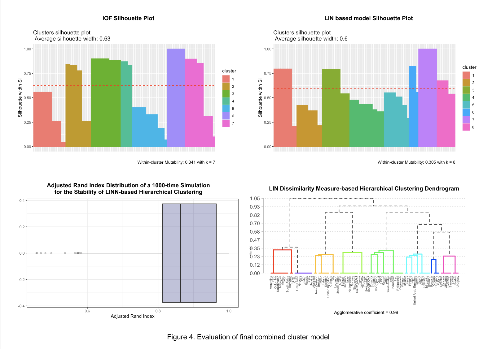

# Decision Support Dashboard for Study Abroad Selection

The Decision Support Dashboard for Study Abroad Selection is an interactive tool developed to aid students in selecting study abroad destinations, especially amidst the challenges posed by the COVID-19 pandemic. Leveraging diverse datasets including COVID-19 trends, socioeconomic indices, and university rankings, this dashboard provides comprehensive decision-making support. Advanced clustering algorithms such as Dynamic Time Warping and hierarchical clustering are employed to group countries based on their COVID-19 situations and socioeconomic factors. The dashboard, deployed on Tableau, enables users to explore and compare study abroad options based on various criteria, facilitating informed decision-making in uncertain times.

## Key Features:

* Integration of COVID-19 trends, socioeconomic indices, and university rankings data.
* Utilization of advanced clustering algorithms for grouping countries.
* Interactive visualization and comparison of study abroad options.
* Seamless deployment on Tableau for user-friendly access.

## Numerical Results:

* Achieved an average adjusted Rand index of 0.87 for clustering accuracy.
* Identified distinct clusters of countries based on COVID-19 trends and socioeconomic factors.
* Provided insights into the impact of COVID-19 on study abroad options, facilitating informed decision-making.

This project is designed to empower students with the necessary information and insights to make well-informed decisions about their study abroad endeavors, even in the face of unprecedented challenges.

## Dashboard on Tablau:
https://public.tableau.com/app/profile/christopher.tong2548/viz/COVID-03DEMO/Home?publish=yes
